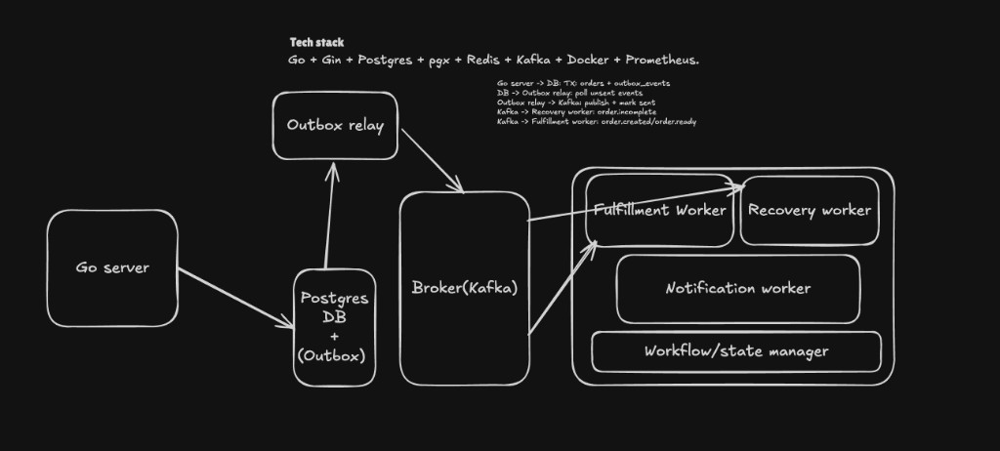
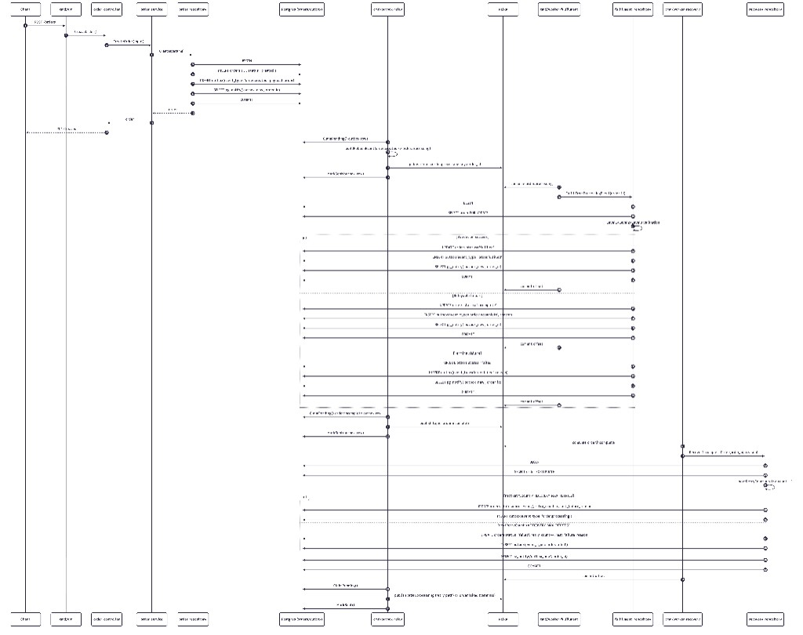

# orders-platform

## Architecture Overview

## Order Processing Flow

## Code Map

- API entry: `cmd/api/main.go`
- HTTP and service:
  - `internal/controller/order_controller.go`
  - `internal/service/order_service.go`
- Order and outbox transaction:
  - `internal/repository/order_repository.go`
- Relay transform and publish:
  - `internal/outbox/relay.go`
  - `internal/outbox/kafka_publisher.go`
  - `internal/ordercontract/contract.go`
- Fulfillment worker and validations:
  - `cmd/worker-fulfillment/main.go`
  - `internal/fulfillment/repository.go`
  - `internal/fulfillment/validation.go`
  - `internal/fulfillment/external_verifier.go`
- Recovery worker:
  - `cmd/worker-recovery/main.go`
  - `internal/recovery/repository.go`
- Notifications worker:
  - `cmd/worker-notifications/main.go`
  - `internal/notification/processor.go`
  - `internal/notification/openai_generator.go`
  - `internal/notification/whatsapp_webhook_sender.go` (Meta Cloud API sender)
  - `internal/notification/whatsapp_twilio_sender.go` (Twilio WhatsApp sender)
- Schema support:
  - `internal/database/schema.go`

## Verification

- End-to-end runbook: `docs/end-to-end-verification-playbook.md`
- Env template: `.env.example`
- Postman collection: `docs/postman/order-system.postman_collection.json`

## Notifications Setup (WhatsApp + OpenAI)

- For local logs only: `NOTIFICATION_CHANNEL=stdout`
- For WhatsApp delivery:
  - `NOTIFICATION_CHANNEL=whatsapp`
  - `NOTIFICATION_RECIPIENT=+<customer_e164_phone>`
  - `WHATSAPP_PROVIDER=twilio` (default) or `meta`
  - If provider is `twilio`:
    - `TWILIO_ACCOUNT_SID=<twilio_account_sid>`
    - `TWILIO_AUTH_TOKEN=<twilio_auth_token>`
    - `TWILIO_WHATSAPP_FROM=whatsapp:+14155238886`
  - If provider is `meta`:
    - `WHATSAPP_ACCESS_TOKEN=<meta_cloud_api_token>`
    - `WHATSAPP_PHONE_NUMBER_ID=<meta_phone_number_id>`
- OpenAI-generated copy is optional:
  - set `OPENAI_API_KEY` to enable AI-generated messages
  - when missing/unavailable, the worker automatically uses fallback templates
